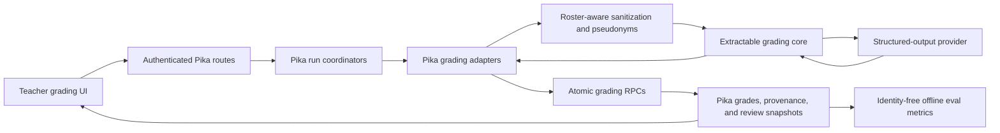

# Grading Architecture

This is the canonical entry point for Pika's AI-assisted grading design. It
describes the implemented assignment, test, and repository-review paths, the
privacy and persistence boundaries, and the current evaluation loop.

Use this guide before changing grading behavior. Follow the linked rollout
guides before changing schema or deploying a grading contract.

## Current State

- Pika is the production grading application and system of record.
- `src/lib/grading/*` is a database-independent grading core kept extractable by
  an enforced architecture rule.
- Pika-specific adapters sanitize classroom data, build core inputs, map results
  back to Pika fields, and coordinate durable work.
- OpenAI Responses is the only implemented runtime provider. The default model
  is `gpt-5-nano`, configurable through `OPENAI_GRADING_MODEL`.
- Assignment and test suggestions persist with bounded versioned provenance.
- Teacher actions create identity-free review snapshots for offline metrics.
- Normal grading does not call remote Gradex. The remote Gradex worker remains
  disabled during the internal grading pilot.

## Goals

1. Keep classroom identity and production persistence inside Pika.
2. Send only sanitized, allow-listed grading inputs to providers.
3. Make grading behavior versioned, testable, and reproducible.
4. Commit grades, provenance, run state, and review state atomically.
5. Measure teacher agreement before paying to replay candidate prompts or models.
6. Preserve an extraction path for a future standalone grading service without
   coupling today's runtime to that service.

## Non-Goals

- The core does not query Supabase, authorize teachers, load rosters, fetch
  GitHub data, or update Pika records.
- Provider output is never authoritative by itself. It is validated, normalized,
  sanitized, persisted as a suggestion, and subject to teacher review.
- The current eval snapshot is not a complete replay dataset. It intentionally
  excludes student work, questions, answers, and feedback text.
- The classroom Gradex archive extract is not a runtime grading transport.

## End-To-End Boundary



The trust boundary is between the Pika adapter and the grading core. Everything
before that boundary may understand Pika records and local IDs. Everything sent
through the core must already be sanitized and use provider-safe references.

## Ownership By Layer

| Layer | Owns | Must not own |
|---|---|---|
| UI and API routes | Teacher intent, authentication, authorization, response presentation | Prompt construction, provider calls, direct grading persistence logic |
| Run coordinators in `src/lib/server/*-ai-grading-runs.ts` | Durable run/item state, leases, bounded ticks, retries, concurrency, resumability | Rubric or provider-specific output parsing |
| Pika adapters such as `ai-grading.ts`, `ai-test-grading.ts`, and `repo-review-ai.ts` | Roster-aware sanitization, Pika input conversion, pseudonym maps, telemetry, compatibility result shapes | Direct UI concerns or generic persistence |
| `src/lib/grading/*` core | Rubric/result contracts, profiles, prompts, structured-output execution, provider interfaces, provenance shapes, eval metrics | Pika database, server, route, UI, shared application, or domain-type dependencies |
| Provider adapters | Provider request/response protocol, timeout/network classification, bounded output retry, token usage | Pika IDs, database writes, teacher workflow |
| Server persistence helpers and PostgreSQL RPCs | Atomic grades, feedback, provenance, run finalization, revision checks, teacher-review transitions | Provider request construction |

`scripts/lib/architecture-boundaries.ts` enforces the grading-core isolation rule
for runtime and type-only imports. Moving a Pika dependency into the core is an
architecture change, not a convenience refactor.

## Grading Core

The core is organized around five contracts:

1. `contracts.ts` validates rubrics, normalized results, token usage, and
   assignment/test provenance.
2. `profiles/types.ts` defines a versioned profile with a rubric, prompt builder,
   output schema, parser, and normalization function.
3. `engine.ts` asks a provider for strict structured output, validates the
   profile output, checks every rubric criterion and score range, calculates
   weighted totals, and returns a canonical result.
4. `providers/types.ts` defines provider-neutral requests, responses, and error
   categories.
5. `evals.ts` validates teacher-review snapshots and calculates offline quality
   metrics without model or API calls.

The OpenAI adapter uses the Responses API with `store: false` and strict JSON
Schema output. It retries once with a larger output-token limit only when the
first response is incomplete because of `max_output_tokens`. Network, timeout,
rate-limit, server, configuration, and invalid-response failures remain distinct
so Pika coordinators can make bounded retry decisions.

## Versioning Model

Every persisted provider-backed grade identifies the behavior that produced it.
These versions have different meanings and should not be collapsed:

| Field | Meaning | Increment when |
|---|---|---|
| Provider | Runtime implementation, currently `openai` | The provider implementation changes |
| Model | Provider model selected at runtime | The configured model changes |
| Policy version | Execution settings such as reasoning effort, timeout, and retry policy | Execution behavior changes materially |
| Prompt version | Exact prompt/guideline behavior | Prompt wording or prompt assembly changes grading behavior |
| Grading profile version | Input/output normalization and grading behavior as a unit | Profile semantics or normalized result mapping changes |
| Rubric version | Criteria, scales, or weights | Rubric meaning or scoring changes |
| Schema version | Stored provenance or review JSON contract | Persisted JSON shape changes |

Do not reuse a version identifier after changing its behavior. Tests should pin
the expected versions, prompts, schemas, score normalization, and provenance.

## Assignment Grading

The assignment path uses:

- `src/lib/server/assignment-ai-grading-runs.ts` for resumable grading runs;
- `src/lib/ai-grading.ts` for Pika conversion, sanitization, telemetry, and error
  translation;
- `src/lib/grading/profiles/pika-assignment.ts` for the versioned Completion,
  Thinking, and Workflow rubric and feedback contract;
- `src/lib/server/assignment-grades.ts` and assignment grading RPCs for atomic
  persistence.

The adapter extracts text and supported submission artifacts, verifies that the
submission has gradable content, applies roster-aware sanitization, and invokes
the core. Provider feedback is sanitized again before persistence. The result is
mapped to Pika's `score_completion`, `score_thinking`, `score_workflow`, and
feedback fields with assignment provenance.

Assignment auto-grading is processed in bounded chunks with limited concurrency,
leases, and at most three attempts. A tick can be resumed after request or
process failure without treating one long HTTP request as the job boundary.

## Test Grading

The test path uses:

- `src/lib/server/test-ai-grading-runs.ts` for durable run and item coordination;
- `src/lib/ai-test-grading.ts` for answer-key/reference handling, roster-aware
  sanitization, score buckets, batching, pseudonyms, telemetry, and provenance;
- `src/lib/grading/profiles/pika-test-open-response.ts` and
  `pika-test-prompt-guidelines.ts` for versioned manual/bulk prompt behavior;
- `src/lib/server/test-grades.ts` and test grading RPCs for atomic persistence.

Open-response grading prefers a teacher answer key. When needed, it can generate
and cache up to three sanitized reference answers. Batch requests replace local
response IDs with provider refs and map them back only inside Pika. Responses are
graded independently, constrained to the question's maximum score or configured
score buckets, and persisted with single/batch operation provenance.

The durable coordinator uses bounded chunks, per-question concurrency,
microbatches, leases, retry backoff, and at most three attempts. Manual AI
suggestion routes use the same preparation and profile contracts without taking
ownership of the durable bulk-run lifecycle.

## Repository-Review Grading

Repository review remains a Pika-owned workflow because Pika fetches repository
evidence, maps identities, computes contribution metrics, owns run state, and
persists results. `src/lib/repo-review-ai.ts` sanitizes evidence and uses
provider-safe change refs before invoking versioned profile helpers in
`src/lib/grading/profiles/pika-repo-review.ts`.

If OpenAI is unavailable or unconfigured, repository-review feedback can use the
documented local heuristic result. That path records `pika-local`, its heuristic
model/profile versions, zero provider requests, and null token usage. It is not
reported as an OpenAI result.

Repository-review results use the assignment-document persistence and teacher
review contract.

## Privacy And Provider Egress

The complete egress contract lives in [AI grading egress](./ai-grading-egress.md).
The non-negotiable rules are:

- never send raw Supabase rows or UI domain objects to a provider;
- load roster/profile names and replace known names before provider egress;
- fail closed if required classroom sanitization context cannot be loaded;
- redact direct identifiers such as emails, phone numbers, student numbers,
  UUIDs, addresses, and URLs unless an explicitly tested profile allows a
  sanitized artifact representation;
- use local-only provider refs instead of Pika IDs;
- validate outbound payloads by allow-list and sanitize provider output before
  saving it;
- keep provider retention disabled where supported.

Pseudonym-to-local-ID maps remain in Pika and are never persistence or provider
contracts.

## Persistence And Provenance

Provider-backed results and provenance commit together through service-role-only
RPCs. Provenance records provider, model, policy, prompt, profile, rubric,
request count, and token usage. Test provenance additionally records a random
grading request ID, single/batch operation, and batch size.

PostgreSQL constraints reject unknown keys, invalid values, oversized payloads,
and model/provenance mismatches. Triggers clear stale provenance when older or
manual writers replace AI-owned fields without replacement provenance.

Migrations 101 through 103 add the current assignment, test, and repository
review provenance contracts. Migration 104 adds teacher-review snapshots. See
the assignment and test rollout guides before changing or deploying these
contracts.

## Teacher Review And Evaluation

Migration 104 creates one bounded `grading-review-v1` snapshot on each relevant
assignment document or test response:

1. A provider-backed suggestion initializes a `pending` review.
2. Teacher edits update final criterion scores and feedback disposition without
   overwriting the original suggestion.
3. Returning work marks the review `reviewed`; clearing a test suggestion can
   mark it `dismissed`.
4. Changed student work clears stale review/provenance so it cannot be paired
   with a different submission.

The snapshot contains scores, feedback disposition, and versioned provenance,
but no identity, submission content, answer text, or feedback text. Offline
metrics calculate criterion and total-score error, acceptance/edit rates,
feedback disposition, and provider/model/profile counts.

Run the synthetic contract scenarios with:

```bash
pnpm eval:grading-reviews scripts/fixtures/grading-review-scenarios.json
```

This command makes no provider calls and does not measure real grading quality.
The next calibration phase requires an explicit local-admin export that joins
reviewed outcomes to the minimum sanitized grading inputs and writes a private,
versioned eval set. Only that opt-in set should be used for paid candidate
prompt/model replay.

## Pika And Gradex

Pika currently owns the complete production grading loop. The core is isolated
so it can later move behind a service boundary, but extraction is not required
for current grading to work.

A future Gradex service should accept a sanitized, versioned grading envelope
and return a versioned result. It must not require direct access to Pika's
production database, raw classroom records, roster identifiers, or editor
history. Pika would continue to own authentication, teacher intent,
sanitization, identity maps, persistence, and review workflows.

Do not route normal grading to Gradex until a separately reviewed integration
defines authentication, idempotency, failure/retry behavior, privacy tests,
version compatibility, observability, and rollback. The existing classroom
Gradex archive extract is deidentified analytics infrastructure, not that API.

## Extending Grading Safely

For a new rubric, prompt, assessment type, or provider:

1. Define or update a versioned core profile and strict structured-output schema.
2. Add profile tests for prompt construction, parsing, missing/duplicate
   criteria, score bounds, normalization, and version metadata.
3. Build or update a Pika adapter that accepts only the minimum domain input,
   sanitizes before crossing the core boundary, and maps provider refs locally.
4. Add provider support behind `StructuredOutputProvider`; do not branch on
   provider details inside profiles or Pika routes.
5. Persist result and provenance atomically, with database constraints matching
   the TypeScript schema.
6. Add route/coordinator tests for authorization, retries, partial failure,
   idempotency, stale work, and recovery.
7. Update teacher-review/eval handling when criterion semantics change.
8. Follow migration-first rollout guidance when application code requires new
   columns or RPCs.
9. Update this guide and the relevant version identifiers.

## Verification Map

| Surface | Primary verification |
|---|---|
| Core contracts and engine | `tests/lib/grading/engine.test.ts` and profile tests under `tests/lib/grading/` |
| Assignment adapter | `tests/unit/ai-grading.test.ts` |
| Test adapter | `tests/unit/ai-test-grading.test.ts` |
| Repository review adapter | `tests/unit/repo-review-ai.test.ts` |
| Architecture isolation | `tests/unit/architecture-boundaries.test.ts` and `pnpm check:architecture` |
| Assignment atomic persistence | `scripts/check-atomic-assignment-feedback-returns.sh` |
| Test atomic persistence | `scripts/check-atomic-test-grading.sh` |
| Teacher review metrics | `tests/lib/grading/teacher-correction-evals.test.ts` and `pnpm eval:grading-reviews ...` |
| Full integration gate | `pnpm test`, `pnpm exec tsc --noEmit`, `pnpm lint`, `pnpm build`, and exact-head CI |

## Related Guides

- [AI grading egress](./ai-grading-egress.md)
- [Teacher grading evaluations](./teacher-grading-evals.md)
- [Atomic assignment grading rollout](./atomic-assignment-grading-rollout.md)
- [Atomic test grading rollout](./atomic-test-grading-rollout.md)
- [Schema rollout checklist](./schema-rollout-checklist.md)
- [Core architecture](../core/architecture.md)
- [Testing strategy](../core/tests.md)
